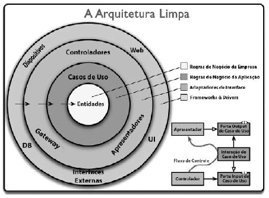
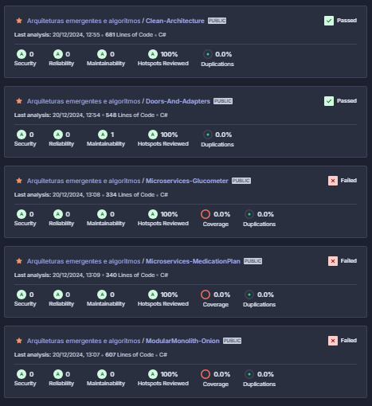

# 🧹 Arquitetura Limpa

## 🔎 Oque é ?
O objetivo da Arquitetura Limpa, como abordagem de composição de sistemas, é organizar e estruturar códigos de programação para facilitar o desenvolvimento, implantação, manutenção e integração de regras de negócios empresariais (Martin, 2020). A arquitetura limpa propõe uma camada a nível mais externo que se separa das camadas mais internas do software, assim, os frameworks podem ser utilizados, embora sejam facilmente substituídos.

Através deste conceito é possível realizar a separação da camada de negócios de dependências externas, seguindo assim o princípio de responsabilidade única do SOLID. Nesse contexto, pode-se usar abstrações, onde, através da utilização do design pattern de injeção de dependência, é possível a implementação de interfaces sem a necessidade de um código concreto. Para isto, a estrutura da arquitetura limpa segue a ordem da imagem abaixo:

  
*Figura: Estrutura da Arquitetura Limpa. Fonte:Robert Cecil Martin*  

Para entender a figura, deve-se tomar como ponto de partida a regra da dependência, que diz que as dependências só podem apontar para dentro do círculo. Nada declarado externamente ao círculo pode ser observado pelas camadas internas. Assim, para compor a arquitetura, tem-se 4 níveis:

- **Entidades:** Reúnem regras cruciais de negócio da empresa. Concentram regras gerais e, no nível mais alto, nada deve afetá-las.
- **Casos de uso:** Reúnem regras de negócio específicas da aplicação. Orquestram fluxo de dados e orientam as entidades, sendo isoladas das camadas inferiores e exteriores.
- **Adaptadores de interface:** Funcionam como um adaptador, no qual os dados são convertidos para o formato mais conveniente para quem vai consumi-los. Os adaptadores fazem isso na ida e na volta de informações.
- **Frameworks e drivers:** Camada mais externa, contém base de dados, frameworks, ferramentas, drivers, etc. A ideia é manter esses elementos de fora da aplicação.

## 📎 Provas de conceito

Ao submeter a Arquitetura Limpa à prova de conceito, foi observado um nível crescente de trabalho e linhas ao adicionar alguma feature, o que foi comprovado posteriormente pelo Sonar. Todavia, essa crescente vem do foco em isolar as camadas da arquitetura através de interfaces. Algo também observado foi a facilidade em realizar testes de unidade, isto ocorre devido às interfaces localizadas entre as camadas. No entanto, isso não facilita os testes de integração, já que é necessário utilizar várias estruturas para apenas um teste.

## 🪐 SonarQube
A figura 2 apresenta os dados coletados pelo SonarQube referentes a esta arquitetura.

  
*Figura 2: SonarQube. Fonte:Autor*  

A figura 3 apresenta as linhas de código utilizadas para resolver a POC para cada arquitetura.

  
*Figura 3: SonarQube. Fonte:Autor*  

## 📖 Referências

1. dotnet. (2023, novembro). Clean Architecture with ASP.NET Core 8. *YouTube*. Disponível em: [https://www.youtube.com/watch?v=yF9SwL0p0Y0](https://www.youtube.com/watch?v=yF9SwL0p0Y0).

2. Martin, R. C. (2017). *Clean Architecture: A Craftsman's Guide to Software Structure and Design*. 1ª ed. Prentice Hall Press, USA.

## 📅 Versionamento

| Versão |    Data    |         Descrição          |  Autor(es)  |
| :----: | :--------: | :------------------------: | :---------: |
| `1.0`  | 04/12/2024 | Criação de documento | Kauã |
| `1.1`  | 19/12/2024 | Adição do sonar e referências | Kauã |
